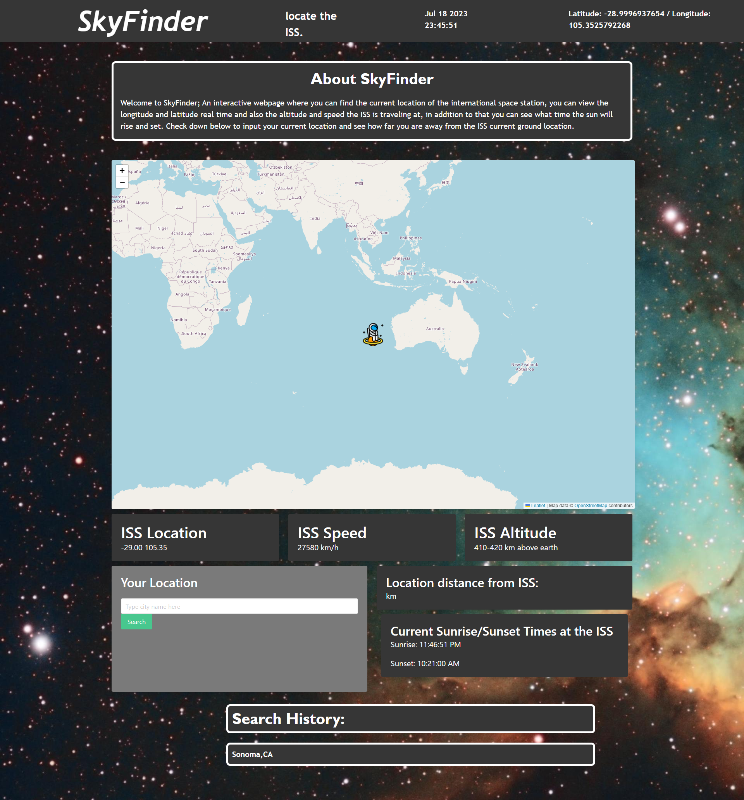

# SKY FINDER

## Description

Sky Finder is an interactive web application that allows users to track the current location of the International Space Station (ISS) in real-time. The application displays the longitude and latitude of the ISS, its speed, altitude, and the corresponding location on the ground. Additionally, users can input their current location to calculate the distance between their location and the ISS's current ground position. The application also provides information about the sunrise and sunset times at the ISS's location.
 [visit the Deployed site](https://ssherp.github.io/SkyFinder-project/)

## Features

*	Real-time tracking of the ISS's location on a map.
*	Display of ISS's longitude and latitude coordinates.
*	Display of ISS's speed and altitude.
*	Input field to enter the user's location and calculate the distance from the ISS.
*	Display of sunrise and sunset times at the ISS's location.
*	Search history functionality to store and display previously searched locations.

## Usage

1.	Upon opening the application, the current location of the ISS will be displayed on the map.
2.	The latitude and longitude coordinates of the ISS will be shown in the "ISS Location" card.
3.	The speed and altitude of the ISS will be displayed in their respective cards.
4.	To calculate the distance between the user's location and the ISS, enter the city name in the "Your Location" input field and click the "Search" button.
5.	The distance between the user's location and the ISS will be displayed in kilometers.
6.	The sunrise and sunset times at the ISS's location will be shown in the "Current Sunrise/Sunset Times at the ISS" card.
7.	The search history will be displayed below the input section, showing previously searched city names. Clicking on a city name will recalculate the distance and update the display.

## Technologies Used

*   HTML
*	CSS (Bulma framework)
*	JavaScript
*	Leaflet.js (JavaScript library for interactive maps)
*	Day.js (JavaScript library for date and time manipulation)

## Contributors:

### Timothy Su
* [[Portfolio](https://timothysu1.github.io/portfolio-timothysu/)
* [LinkedIn](https://www.linkedin.com/in/timothysu1/)
### Sonam Sherpa
* [Portfolio](htps://ssherp.github.io/portfolio/)
* [LinkedIn](https://www.linkedin.com/in/sonam-sherpa-306559280)
### Sam Thomas
[Portfolio](https://figuri.github.io/figuri-portfolio/)
[LinkedIn](https://www.linkedin.com/in/samuel-thomas-b82614183/)

## credits:

*	Leaflet.js: https://leafletjs.com/
*	Bulma CSS Framework: https://bulma.io/
*	Day.js: https://day.js.org/
*	OpenStreetMap: https://www.openstreetmap.org/
*	Where The ISS At? API: https://wheretheiss.at/
*	MapQuest Geocoding API: https://www.mapquestapi.com/geocoding/
*	Sunrise-Sunset API: https://sunrise-sunset.org/api

## learning Point:

One of the key learning points from this project is the integration of APIs to fetch real-time data. The project demonstrates how to make API requests using `fetch()` to obtain the ISS coordinates, sunrise and sunset times, and geolocation data. It highlights the importance of handling asynchronous operations and utilizing promises to handle API responses.
 Additionally, the project showcases the use of mapping libraries like Leaflet.js to visualize and interact with geographical data. It provides insights into working with maps, markers, and icons, as well as implementing map tile layers to display map data from external sources.
 Overall, this project offers valuable hands-on experience in working with APIs, asynchronous programming, and mapping libraries, which are essential skills for web development and data visualization.
